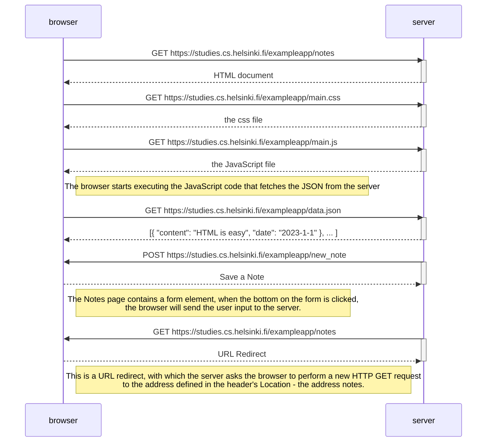

```mermaid
sequenceDiagram
participant browser
participant server

    browser->>server: GET https://studies.cs.helsinki.fi/exampleapp/notes
    activate server
    server-->>browser: HTML document
    deactivate server

    browser->>server: GET https://studies.cs.helsinki.fi/exampleapp/main.css
    activate server
    server-->>browser: the css file
    deactivate server

    browser->>server: GET https://studies.cs.helsinki.fi/exampleapp/main.js
    activate server
    server-->>browser: the JavaScript file
    deactivate server

    Note right of browser: The browser starts executing the JavaScript code that fetches the JSON from the server

    browser->>server: GET https://studies.cs.helsinki.fi/exampleapp/data.json
    activate server
    server-->>browser: [{ "content": "HTML is easy", "date": "2023-1-1" }, ... ]
    deactivate server

    server->>browser: POST https://studies.cs.helsinki.fi/exampleapp/new_note
    activate server
    browser-->>server: Save a Note
    deactivate server


    Note right of browser: The Notes page contains a form element, when the bottom on the form is clicked,<br>the browser will send the user input to the server.

    server->>browser: GET https://studies.cs.helsinki.fi/exampleapp/notes
    activate server
    browser-->>server: URL Redirect
    deactivate server


    Note right of browser: This is a URL redirect, with which the server asks the browser to perform a new HTTP GET request <br>to the address defined in the header's Location - the address notes.
```
