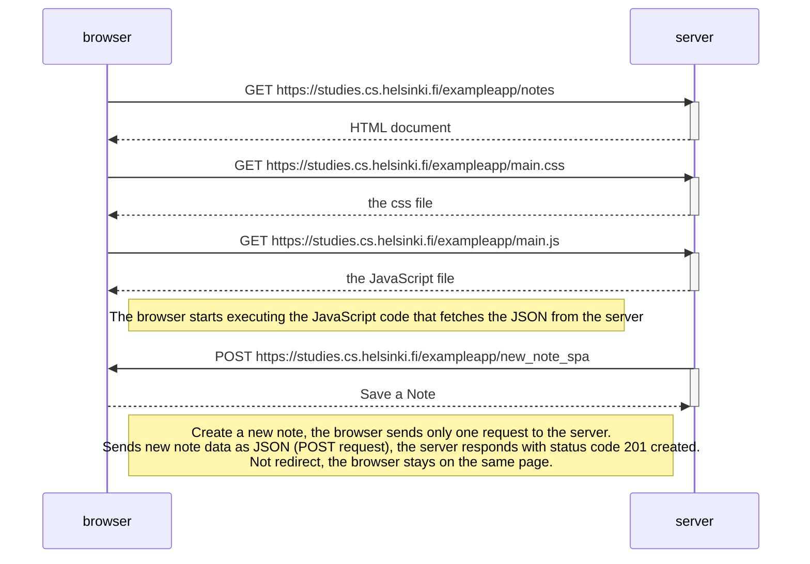

```mermaid
sequenceDiagram
    participant browser
    participant server

    browser->>server: GET https://studies.cs.helsinki.fi/exampleapp/notes
    activate server
    server-->>browser: HTML document
    deactivate server

    browser->>server: GET https://studies.cs.helsinki.fi/exampleapp/main.css
    activate server
    server-->>browser: the css file
    deactivate server

    browser->>server: GET https://studies.cs.helsinki.fi/exampleapp/main.js
    activate server
    server-->>browser: the JavaScript file
    deactivate server

    Note right of browser: The browser starts executing the JavaScript code that fetches the JSON from the server

    server->>browser: POST https://studies.cs.helsinki.fi/exampleapp/new_note_spa
    activate server
    browser-->>server: Save a Note
    deactivate server

    Note right of browser: Create a new note, the browser sends only one request to the server.<br>  Sends new note data as JSON (POST request), the server responds with status code 201 created.<br> Not redirect, the browser stays on the same page.
```
